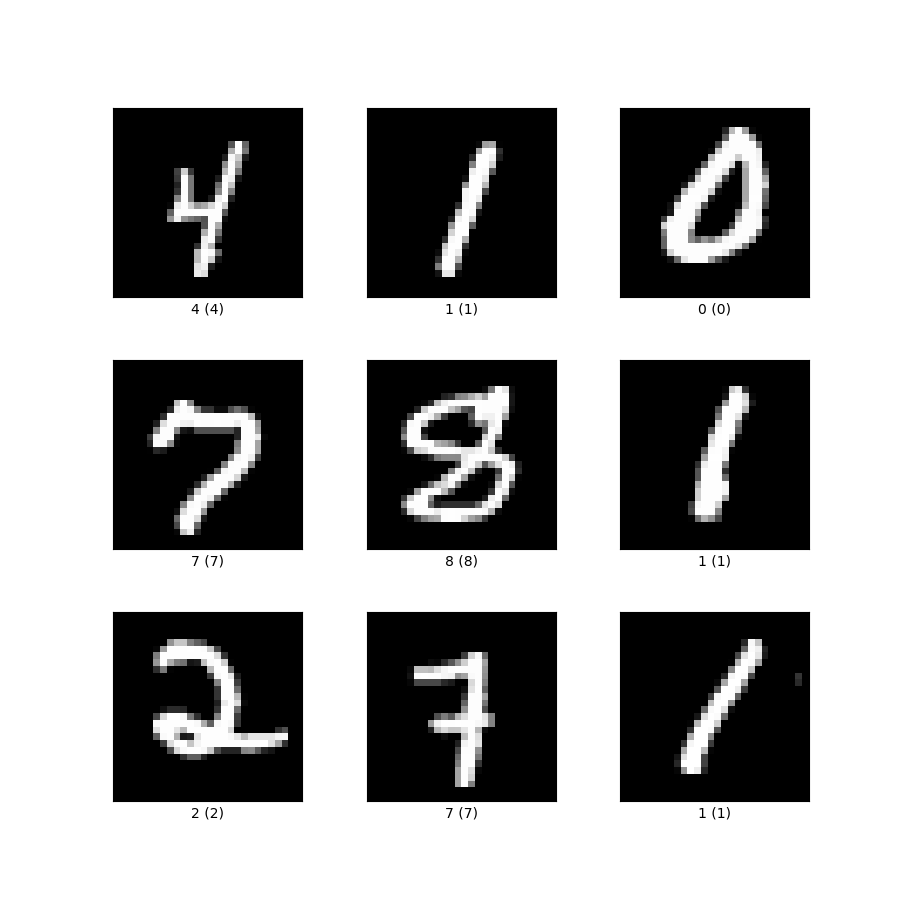

# Designing a convolutional neural network for hand-written digits classification
This is the technical project for the *Machine Learning and Applications* exam, at University Federico II of Naples.



## Introduction
The aim of this project is to develop from a scratch a *MATLAB* library, implementing a generic shallow neural network and convolutional neural network. These networks will then be used to classify images of hand-written digits, using the [*MNIST* dataset](http://yann.lecun.com/exdb/mnist/).

A complete documentation of the library, together with practical examples and the solution of the MNIST classification problem, is presented in a [*MATLAB Live Script*](./Report.mlx). The same report is [in pdf too](./Report.pdf).


## Download and compile
In order to execute the content of this repository you need *MATLAB* of course, but no other additional packages are needed.

Clone the repository using the following command:
```
    $ git clone https://github.com/micmarolla/conv_network
```
and open the file `./Report.mlx`. Since the code is organized in different subdirectories, remember to add them to the path using the command *Add to Path -> Selected Folders and Subfolders*.
